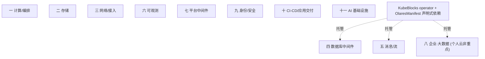

# tech/tech-stack.md — 方向 6「基础设施与中间件」分类图（逐项目）

> [directions.md](/Users/pengpeng/seo/directions/directions.md) 方向 6 的基础设施分类总表，**扁平 11 大类**（不再分 IaaS/PaaS 大层，IaaS/PaaS 只作行文视角）→ 子类 → **每个项目一行**：给「介绍 / 许可 / 其它值得介绍的 / 公有云替代 / Olares 状态 / SEO 报告」。搜单一底层技术（tailscale/headscale/frp、K3s、JuiceFS、KubeBlocks、PostgreSQL、Qdrant、NATS 等）的人往往嫌自己搭一套麻烦——Olares 把它们内置/一键化，是"更省事的选择"。
>
> **这些是长尾 SEO 机会，不是主推卖点**：可做技术文、"X on Olares"、"self-hosted X"、"X alternative"、技术对比等长尾内容，但**不进品牌叙事、首屏与 campaign 文案**（主推口径见 [basic/olares.md](/Users/pengpeng/seo/basic/olares.md) 品牌口径）。
>
> **核心锚点**：Olares 对标公有云 IaaS/PaaS/SaaS 三层给开源平替，平台层**中间件由 KubeBlocks operator 托管**（四/五/八 大类多数引擎），应用在 `OlaresManifest.yaml` 声明式依赖 postgres/redis 等、系统**自动注入连接凭据**；共享单 PostgreSQL 16（兼全文检索+向量）+ KVRocks（Redis 兼容）为默认。
>
> **底稿**：中间件逐项目深挖见 [research/middleware-taxonomy.md](/Users/pengpeng/seo/directions/tech/research/middleware-taxonomy.md)（76 源）；云原生×三云见 [research/cloud-infra-taxonomy.md](/Users/pengpeng/seo/directions/tech/research/cloud-infra-taxonomy.md)；AI 基础设施见 [research/ai-infra.md](/Users/pengpeng/seo/directions/tech/research/ai-infra.md)。索引与二轮核实来源见 [research/README.md](/Users/pengpeng/seo/directions/tech/research/README.md)。单工具报告见 [reports/](/Users/pengpeng/seo/directions/tech/reports)。
>
> **图例**：Olares 状态 ✅ 已内置｜🟡 部分/Market 可装/定位重叠｜⬜ 缺口；「KB」＝KubeBlocks 官方 addon 托管（[supported-addons](https://kubeblocks.io/docs/preview/user_docs/overview/supported-addons)）；公有云替代取 AWS/Azure/GCP 最接近服务（无 1:1 等价用「—」）；SEO 报告有链＝已产出、`⬜ 待做`＝backlog；许可/CNCF/star 为快变数据（AS_OF 2026-07-05），引用前以官网/CNCF 复核。

---

## 一、计算 / 编排

### 容器编排

| 项目 | 介绍 | 许可 | 其它值得介绍的 | 公有云替代 | Olares 状态 | SEO 报告 |
|------|------|------|------|------|------|------|
| Kubernetes | 容器编排事实标准 | Apache-2.0 | CNCF 毕业(2018)；生态与可移植性基准，完整版对单机偏重 | EKS / AKS / GKE | 🟡 可选 | ⬜ 待做 |
| **K3s** | <100MB 单二进制轻量发行版 | Apache-2.0 | CNCF 认证；默认 SQLite/Kine 替代 etcd、直用 containerd，边缘/个人云首选 | — | ✅ 内置（默认底座） | ⬜ 待做 |
| k0s | 零主机依赖、最贴上游的单二进制 | Apache-2.0 | Mirantis；~230MB，要"纯净 K8s"用 | — | ⬜ | ⬜ 待做 |
| MicroK8s | snap 打包、addon 体系 | Apache-2.0 | Canonical；dqlite HA，Ubuntu/工作站友好 | — | ⬜ | ⬜ 待做 |
| RKE2 | CIS 加固的安全发行版 | Apache-2.0 | Rancher/SUSE；FIPS 140-2，企业合规 | — | ⬜ | ⬜ 待做 |

### 容器运行时

| 项目 | 介绍 | 许可 | 其它值得介绍的 | 公有云替代 | Olares 状态 | SEO 报告 |
|------|------|------|------|------|------|------|
| **containerd** | K8s CRI 运行时，多数发行版默认 | Apache-2.0 | CNCF 毕业；Docker 自 K8s 1.24 起不再作直接运行时 | Fargate 底层 / AKS 默认 / GKE 默认 | ✅ 内置 | ⬜ 待做 |
| CRI-O | 为 K8s 而生的轻量 CRI 运行时 | Apache-2.0 | CNCF 毕业；OpenShift 默认 | — | ⬜ | ⬜ 待做 |

---

## 二、存储

### 对象存储

| 项目 | 介绍 | 许可 | 其它值得介绍的 | 公有云替代 | Olares 状态 | SEO 报告 |
|------|------|------|------|------|------|------|
| **MinIO** | S3 协议事实参考实现，单二进制 | AGPLv3 | 社区版仓库 2026-02 归档转商业版 AIStor（有社区 fork），已"事实闭源" | S3 / Blob / Cloud Storage | ✅ 内置(KB) | ⬜ 待做 |
| Ceph RGW | Ceph 的对象存储网关 | LGPL-2.1/3.0 | 统一存储的一部分，运维重 | S3 / Blob / Cloud Storage | ⬜ | ⬜ 待做 |

### 块存储

| 项目 | 介绍 | 许可 | 其它值得介绍的 | 公有云替代 | Olares 状态 | SEO 报告 |
|------|------|------|------|------|------|------|
| **OpenEBS** | 容器附着存储(CAS) | Apache-2.0 | CNCF Sandbox；Mayastor 引擎用 NVMe-oF+SPDK，"给数据库用的高性能 PV" | EBS / Managed Disks / Persistent Disk | ✅ 内置 | ⬜ 待做 |
| Longhorn | K8s 原生分布式块存储 | Apache-2.0 | CNCF Incubating（来源有分歧，以 CNCF 为准）；SUSE/Rancher，适合 3–20 节点 | EBS / Managed Disks / Persistent Disk | ⬜ | ⬜ 待做 |
| Rook-Ceph | 在 K8s 上跑 Ceph 的 Operator | Apache-2.0 | CNCF 毕业；继承 Ceph 全部运维复杂度 | EBS / Managed Disks / Persistent Disk | ⬜ | ⬜ 待做 |

### 分布式文件

| 项目 | 介绍 | 许可 | 其它值得介绍的 | 公有云替代 | Olares 状态 | SEO 报告 |
|------|------|------|------|------|------|------|
| **JuiceFS** | 对象存储上的 POSIX 文件系统 | Apache-2.0 | 数据落 S3、元数据落 Redis/MySQL/TiKV；~14.1k star，最适合 ML 数据集共享/大文件 | EFS / Azure Files / Filestore | ✅ 内置 | ⬜ 待做 |
| CephFS | Ceph 的 POSIX 文件系统 | LGPL-2.1/3.0 | 统一存储一部分，需专职团队 | EFS / Azure Files / Filestore | ⬜ | ⬜ 待做 |
| CubeFS | 云原生分布式文件+对象存储 | Apache-2.0 | CNCF 毕业(2025-01)；~5.6k star，管理约 350PB，主打大数据/AI | EFS / Azure Files / Filestore | ⬜ | ⬜ 待做 |

### 备份

| 项目 | 介绍 | 许可 | 其它值得介绍的 | 公有云替代 | Olares 状态 | SEO 报告 |
|------|------|------|------|------|------|------|
| **Restic** | 增量加密备份工具 | BSD-2 | 简洁、去重、多后端 | AWS Backup / Azure Backup / Backup & DR | ✅ 内置（文件同步用 Seafile） | ⬜ 待做 |
| Velero | K8s 应用/PV 备份迁移 | Apache-2.0 | CNCF Sandbox(2026-03) | AWS Backup / Azure Backup / Backup for GKE | ⬜ | ⬜ 待做 |

---

## 三、网络 / 接入

> Mesh VPN（overlay 组网，节点间直连）与反向代理/内网穿透（把内网服务经公网中继暴露出去）**都能实现"内网穿透"，但机制不同**：前者是三层/二层虚拟网、后者是反向隧道到公网入口。

### CNI

| 项目 | 介绍 | 许可 | 其它值得介绍的 | 公有云替代 | Olares 状态 | SEO 报告 |
|------|------|------|------|------|------|------|
| Cilium | eBPF 网络/安全/可观测 | Apache-2.0 | CNCF 毕业(2023)；GKE Dataplane V2 底层 | VPC CNI / Azure CNI / Dataplane V2 | ⬜ | ⬜ 待做 |
| **Calico** | 主流 CNI | Apache-2.0 | Tigera；广泛采用 | VPC CNI / Azure CNI / Dataplane V2 | ✅ 内置（+ CoreDNS 做 DNS） | ⬜ 待做 |

### Ingress / 网关

| 项目 | 介绍 | 许可 | 其它值得介绍的 | 公有云替代 | Olares 状态 | SEO 报告 |
|------|------|------|------|------|------|------|
| **Envoy / Envoy Gateway** | 高性能代理 + Gateway API 实现 | Apache-2.0 | CNCF 毕业；Envoy Gateway 为其官方子项目 | ELB·API GW / App GW / Cloud LB | ✅ 内置 Envoy Gateway | ⬜ 待做 |
| Nginx Ingress | 经典 K8s Ingress 控制器 | Apache-2.0 | 采用最广 | ELB·API GW / App GW / Cloud LB | ⬜ | ⬜ 待做 |

### Service Mesh

| 项目 | 介绍 | 许可 | 其它值得介绍的 | 公有云替代 | Olares 状态 | SEO 报告 |
|------|------|------|------|------|------|------|
| Istio | 功能最全的服务网格 | Apache-2.0 | CNCF 毕业；2026 sidecar mesh 已式微，转 Ambient | App Mesh / Istio add-on / Cloud Service Mesh | ⬜ 缺口（或刻意取舍） | ⬜ 待做 |
| Linkerd | 首个毕业 mesh，轻量 | Apache-2.0 | CNCF 毕业；Rust 数据面 | App Mesh / — / Cloud Service Mesh | ⬜ | ⬜ 待做 |
| Cilium Mesh | 基于 eBPF 的无 sidecar mesh | Apache-2.0 | CNCF 毕业（随 Cilium） | — | ⬜ | ⬜ 待做 |

### Mesh VPN / 隧道

| 项目 | 介绍 | 许可 | 其它值得介绍的 | 公有云替代 | Olares 状态 | SEO 报告 |
|------|------|------|------|------|------|------|
| **Headscale** | 自托管 Tailscale 控制器 | BSD-3 | 差异化优势：公有云无 1:1 等价；~24k star，用官方 Tailscale 客户端 | Site-to-Site VPN·IAP / VPN GW / Cloud VPN·IAP | ✅ 内置 | [headscale](/Users/pengpeng/seo/directions/tech/reports/03-network/mesh-vpn/headscale.md) |
| WireGuard | 现代轻量 VPN 协议 | GPLv2 | 内核级、性能好，是 Tailscale/Headscale 底层 | Site-to-Site VPN / VPN GW / Cloud VPN | 🟡 底层用到 | ⬜ 待做 |
| ZeroTier | L2 虚拟以太网 mesh | MPL-2.0（核心）/控制器商业 | 1.16 起控制器转 source-available；支持二层广播/桥接，吞吐低于 WireGuard | — | ⬜ | ⬜ 待做 |
| NetBird | 身份感知零信任 mesh | BSD-3 | WireGuard 基础 + SSO/细粒度策略，可自托管 | — | ⬜ | ⬜ 待做 |

> 商业方 Tailscale（WireGuard 控制器）归 [commerce/reports/…/tailscale.md](/Users/pengpeng/seo/directions/commerce/reports/05-storage-privacy/privacy-vpn/tailscale.md)。

### 反向代理 / 内网穿透

| 项目 | 介绍 | 许可 | 其它值得介绍的 | 公有云替代 | Olares 状态 | SEO 报告 |
|------|------|------|------|------|------|------|
| **frp** | 内网穿透/反向代理 | Apache-2.0 | 中文富矿（`frp面板`/`frp教程`）；英文 `frp install`/`cloudflare tunnel alternative` | — | ✅ 内置 | [frp](/Users/pengpeng/seo/directions/tech/reports/03-network/reverse-proxy/frp.md) |
| Cloudflare Tunnel | 出站隧道（商业 SaaS，非开源） | 闭源 | 对标对象，非自建侧 | — | ⬜ | ⬜ 待做 |
| rathole | 高性能内网穿透 | Apache-2.0 | Rust；frp 的轻量替代 | — | ⬜ | ⬜ 待做 |

> 商业方 ngrok（内网穿透 SaaS）归 [commerce/reports/…/ngrok.md](/Users/pengpeng/seo/directions/commerce/reports/05-storage-privacy/privacy-vpn/ngrok.md)。

---

## 四、数据库中间件

### 关系型

> PostgreSQL 的能力多经**扩展**获得：Citus（分布式分片/并行）、pgvector（向量检索）、PostGIS（GIS）等——本表把 Citus/pgvector 视作 PostgreSQL 扩展而非并列独立库。

| 项目 | 介绍 | 许可 | 其它值得介绍的 | 公有云替代 | Olares 状态 | SEO 报告 |
|------|------|------|------|------|------|------|
| **PostgreSQL** | 通用关系库，新项目首选 | PostgreSQL License | 复杂查询/JSONB/GIS/扩展生态；**扩展 Citus(分布式,AGPLv3)/pgvector(向量)** | RDS·Aurora / Azure SQL / Cloud SQL·AlloyDB | ✅ 内置(共享主库, KB)；多节点用 Citus | ⬜ 待做 |
| MySQL | 读多 CRUD/LAMP 生态最强 | GPLv2/商业 | 8.4 LTS 支持到 2032 | RDS·Aurora / Azure DB / Cloud SQL | 🟡 可装(KB) | ⬜ 待做 |
| Vitess | MySQL 分片编排层 | Apache-2.0 | CNCF 毕业(2019)；YouTube/Slack 验证，托管代表 PlanetScale | — | ⬜ | ⬜ 待做 |
| MariaDB | 独立治理的 MySQL 分支 | GPLv2 | Wikimedia 大规模用 | RDS / Azure DB / Cloud SQL | 🟡 可装(KB) | ⬜ 待做 |

### 文档型

| 项目 | 介绍 | 许可 | 其它值得介绍的 | 公有云替代 | Olares 状态 | SEO 报告 |
|------|------|------|------|------|------|------|
| **MongoDB** | 服务端高性能文档库 | SSPL | replica set+原生分片+聚合管道；SSPL 非 OSI 认可 | DocumentDB / Cosmos DB / Firestore | 🟡 Market 可装(KB) | ⬜ 待做 |
| CouchDB | 多主复制+离线优先文档库 | Apache-2.0 | HTTP/REST、PouchDB 同步；对标 IBM Cloudant | DocumentDB / Cosmos DB / Firestore | ⬜ | ⬜ 待做 |

### KV / 缓存

| 项目 | 介绍 | 许可 | 其它值得介绍的 | 公有云替代 | Olares 状态 | SEO 报告 |
|------|------|------|------|------|------|------|
| Redis / Valkey | 内存 KV/缓存事实标准 / 其 BSD 分叉 | Redis≥8 三授权含 AGPLv3 / Valkey BSD-3 | Redis 2024 改照催生 Valkey(Linux Foundation)，已成 ElastiCache/Memorystore 默认引擎 | ElastiCache / Azure Cache / Memorystore | 🟡 KB 收录 redis | ⬜ 待做 |
| **KVRocks** | 基于 RocksDB 的持久化 Redis 兼容 KV | Apache-2.0 | ASF 顶级项目(2023-06)；磁盘换内存降本（无 KB addon） | ElastiCache / Azure Cache / Memorystore | ✅ 内置(Redis 兼容层) | ⬜ 待做 |
| Dragonfly | 多线程重写的 Redis 兼容内存库 | BSL 1.1 | 2029-03 转 Apache-2.0；宣称 10–25× 吞吐 | — | ⬜ | ⬜ 待做 |

### 向量库

| 项目 | 介绍 | 许可 | 其它值得介绍的 | 公有云替代 | Olares 状态 | SEO 报告 |
|------|------|------|------|------|------|------|
| Qdrant | 低延迟过滤搜索向量库 | Apache-2.0 | Rust；~29k star，单二进制轻运维，个人云最契合 | OpenSearch 向量 / Azure AI Search / Vertex Vector Search | 🟡 可装(KB) | ⬜ 待做 |
| Weaviate | AI-native 混合检索向量库 | BSD-3 | Go；内置向量化模块+GraphQL+多租户 | OpenSearch 向量 / Azure AI Search / Vertex Vector Search | 🟡 可装(KB) | ⬜ 待做 |
| Milvus | 云原生分布式向量库 | Apache-2.0 | Go/C++；LF AI & Data 2021 毕业(非 CNCF)，可扩十亿级、支持 GPU | Aurora pgvector / Azure AI Search / Vertex Vector Search | 🟡 可装(KB) | ⬜ 待做 |
| **pgvector** | PostgreSQL 向量扩展（非独立库） | PostgreSQL License | 中小规模"在 Postgres 上就够"，免单独运维 | Aurora pgvector | ✅ on 共享 PostgreSQL | ⬜ 待做 |

### 时序库

| 项目 | 介绍 | 许可 | 其它值得介绍的 | 公有云替代 | Olares 状态 | SEO 报告 |
|------|------|------|------|------|------|------|
| VictoriaMetrics | Prometheus 长存/PromQL 兼容 | Apache-2.0 | OSS 集群版免费水平扩展 | Timestream / Data Explorer / — | 🟡 可装(KB) | ⬜ 待做 |
| GreptimeDB | 云原生统一可观测库 | Apache-2.0 | Rust；指标+日志+trace 同引擎，v1.0 GA 2026-04 | Timestream / Data Explorer / — | 🟡 可装(KB) | ⬜ 待做 |
| InfluxDB | 时序库鼻祖 | Apache-2.0+MIT (v3) | 历史上水平集群需企业版 | Timestream / Data Explorer / — | 🟡 可装(KB) | ⬜ 待做 |
| TDengine | IoT/工业物联网高频时序 | AGPLv3 | 社区版含免费集群 | Timestream / — / — | 🟡 可装(KB) | ⬜ 待做 |

### 图数据库

| 项目 | 介绍 | 许可 | 其它值得介绍的 | 公有云替代 | Olares 状态 | SEO 报告 |
|------|------|------|------|------|------|------|
| NebulaGraph | 分布式图数据库 | Apache-2.0 | C++；~12.2k star，Multi-Group Raft 自带一致性；仅入 CNCF Landscape | Neptune / — / — | 🟡 可装(KB nebula) | ⬜ 待做 |
| Neo4j | 最主流图数据库 | GPLv3(社区)/商业 | Cypher 查询语言标杆 | Neptune / — / — | ⬜ | ⬜ 待做 |

### 协调 / 元数据

| 项目 | 介绍 | 许可 | 其它值得介绍的 | 公有云替代 | Olares 状态 | SEO 报告 |
|------|------|------|------|------|------|------|
| **etcd** | 强一致分布式 KV | Apache-2.0 | CNCF 毕业；K8s 默认元数据存储 | 托管 K8s 内置 | ✅ 内置(KB) | ⬜ 待做 |
| Kine | etcd-shim(译到 SQLite/PG/MySQL/NATS) | Apache-2.0 | ~2.3k star；K3s 默认，减组件（无 KB addon） | — | ✅ K3s 默认用 | ⬜ 待做 |
| ZooKeeper | 集中式配置/命名/同步 | Apache-2.0 | Kafka<4.0/Pulsar 曾依赖 | — | 🟡 可装(KB) | ⬜ 待做 |

### 全文检索

| 项目 | 介绍 | 许可 | 其它值得介绍的 | 公有云替代 | Olares 状态 | SEO 报告 |
|------|------|------|------|------|------|------|
| Elasticsearch | Lucene 搜索/日志分析标杆 | AGPLv3/SSPL/ELv2 择一 | 9.3.3(2026-04) | OpenSearch Service / — / Azure AI Search | 🟡 可装(KB) | ⬜ 待做 |
| OpenSearch | 无许可顾虑的 ES 分叉 | Apache-2.0 | AWS 2021 分叉、2024 移交 Linux Foundation OSSF；3.6(2026-04) | OpenSearch Service | 🟡 共享 PostgreSQL 兼全文；可装(KB) | ⬜ 待做 |

---

## 五、消息 / 流

### 消息队列 / 事件流

| 项目 | 介绍 | 许可 | 其它值得介绍的 | 公有云替代 | Olares 状态 | SEO 报告 |
|------|------|------|------|------|------|------|
| **NATS** | 极轻量单二进制消息系统 | Apache-2.0 | CNCF 孵化(2026-02 提交毕业审核中)；pub/sub+request/reply+JetStream 一体，三节点 <256MB/节点（无 KB addon） | SQS / Service Bus / Pub/Sub | ✅ 内置(默认 MQ) | ⬜ 待做 |
| RabbitMQ | 成熟 AMQP 消息代理 | MPL-2.0 | 任务队列/复杂路由/RPC，运维比 Kafka 轻 | SQS / Service Bus / Pub/Sub | 🟡 可装(KB) | ⬜ 待做 |
| Kafka / Strimzi | 分区式持久提交日志 / 其 K8s operator | Apache-2.0 | 事件流事实标准，4.0 移除 ZooKeeper(KRaft)；Strimzi 为 CNCF 孵化 | MSK·Kinesis / Event Hubs / Pub/Sub | 🟡 可装(KB kafka) | ⬜ 待做 |
| Pulsar | 存算分离的消息+流平台 | Apache-2.0 | 原生多租户/分层存储，组件最多最重 | MSK / Event Hubs / Pub/Sub | 🟡 可装(KB) | ⬜ 待做 |

### 大数据流处理

| 项目 | 介绍 | 许可 | 其它值得介绍的 | 公有云替代 | Olares 状态 | SEO 报告 |
|------|------|------|------|------|------|------|
| Flink | 原生逐事件流引擎 | Apache-2.0 | sub-100ms、exactly-once；Netflix 15,000+ 作业 | Managed Flink / Stream Analytics / Dataflow | ⬜ 缺口（个人云非负载） | ⬜ 待做 |
| Spark Structured Streaming | micro-batch 批流统一 | Apache-2.0 | 复用 MLlib/Delta，延迟约 100ms–数秒 | EMR / Synapse / Dataproc | ⬜ | ⬜ 待做 |
| Storm | 最早的逐元组流处理器 | Apache-2.0 | 2026 属 legacy，已被 Flink/Spark 取代 | — | ⬜ | ⬜ 待做 |

---

## 六、可观测

> 三支柱（指标/日志/追踪）+ 采集协议 + 可视化 + 一体化 APM，分层不混。Olares 已内置 OpenTelemetry/Prometheus/Grafana(+Netdata)，追踪/日志全链未确认。

### 采集 / 协议

| 项目 | 介绍 | 许可 | 其它值得介绍的 | 公有云替代 | Olares 状态 | SEO 报告 |
|------|------|------|------|------|------|------|
| **OpenTelemetry** | 厂商中立采集/导出标准（OTLP 协议） | Apache-2.0 | CNCF 毕业(2026-05)；正取代各家私有 SDK/agent，事实标准 | (各家 agent/SDK) | ✅ 内置 | ⬜ 待做 |

### 指标

| 项目 | 介绍 | 许可 | 其它值得介绍的 | 公有云替代 | Olares 状态 | SEO 报告 |
|------|------|------|------|------|------|------|
| **Prometheus** | 时序指标采集+PromQL+告警 | Apache-2.0 | CNCF 毕业；指标金标准 | CloudWatch / Azure Monitor / Cloud Monitoring | ✅ 内置 | ⬜ 待做 |
| VictoriaMetrics | Prometheus 兼容长存储 | Apache-2.0 | 高压缩、PromQL 兼容（亦见四·时序库） | CloudWatch / Azure Monitor / Cloud Monitoring | ⬜ | ⬜ 待做 |

### 日志

| 项目 | 介绍 | 许可 | 其它值得介绍的 | 公有云替代 | Olares 状态 | SEO 报告 |
|------|------|------|------|------|------|------|
| Loki | 日志聚合，ELK 轻量替代 | AGPLv3 | 非 CNCF；与 Prometheus/Grafana 无缝 | CloudWatch Logs / Azure Monitor Logs / Cloud Logging | ⬜ | ⬜ 待做 |
| OpenObserve | 一体化日志/指标/追踪 | AGPLv3 | Rust；对象存储原生、低成本 | CloudWatch Logs / Azure Monitor Logs / Cloud Logging | ⬜ | ⬜ 待做 |

### 追踪

| 项目 | 介绍 | 许可 | 其它值得介绍的 | 公有云替代 | Olares 状态 | SEO 报告 |
|------|------|------|------|------|------|------|
| Jaeger | 分布式追踪标杆 | Apache-2.0 | CNCF 毕业(2019)；后端 Badger/Cassandra/ES/Kafka | X-Ray / App Insights / Cloud Trace | ⬜ | ⬜ 待做 |
| Tempo | 低成本高吞吐 tracing | AGPLv3 | 非 CNCF；TraceQL，打通 metrics→traces→logs | X-Ray / App Insights / Cloud Trace | ⬜ | ⬜ 待做 |

### 可视化 / 面板

| 项目 | 介绍 | 许可 | 其它值得介绍的 | 公有云替代 | Olares 状态 | SEO 报告 |
|------|------|------|------|------|------|------|
| **Grafana** | 可视化面板事实标准 | AGPLv3 | 非 CNCF（Grafana Labs 为白金董事） | Managed Grafana / — / — | ✅ 内置 | ⬜ 待做 |
| Netdata | 单机实时监控面板 | GPLv3 | 开箱即用主机/容器指标 | CloudWatch / Azure Monitor / Cloud Monitoring | ✅ 内置 | ⬜ 待做 |

### 一体化 APM

| 项目 | 介绍 | 许可 | 其它值得介绍的 | 公有云替代 | Olares 状态 | SEO 报告 |
|------|------|------|------|------|------|------|
| SigNoz | metrics+logs+traces 单平台 | MIT | 基于 ClickHouse + OTel 原生 | X-Ray+CloudWatch / App Insights / Cloud Trace+Monitoring | ⬜ | ⬜ 待做 |
| OpenObserve | 一体化可观测（见日志） | AGPLv3 | 单二进制、低成本 | 同上 | ⬜ | ⬜ 待做 |

---

## 七、平台中间件

### Serverless / FaaS

| 项目 | 介绍 | 许可 | 其它值得介绍的 | 公有云替代 | Olares 状态 | SEO 报告 |
|------|------|------|------|------|------|------|
| Knative | K8s 原生 Serverless | Apache-2.0 | CNCF 毕业(2025-09)；Cloud Run 底层，常需 Istio | Lambda / Functions / Cloud Run | ⬜ 缺口 | ⬜ 待做 |
| OpenFaaS | 开发者友好 FaaS | 社区版 MIT | scale-to-zero/SSO 多在 Pro 商业版；非 CNCF | Lambda / Functions / Cloud Functions | ⬜ | ⬜ 待做 |
| Fission | 暖池架构低冷启动 FaaS | Apache-2.0 | CNCF Sandbox；<100ms 冷启动 | Lambda / Functions / Cloud Functions | ⬜ | ⬜ 待做 |

### 工作流编排

| 项目 | 介绍 | 许可 | 其它值得介绍的 | 公有云替代 | Olares 状态 | SEO 报告 |
|------|------|------|------|------|------|------|
| **Argo Workflows** | K8s 原生容器 DAG/step 引擎 | Apache-2.0 | CNCF 毕业(2022)；~16.8k star，适合 CI/CD、ML 训练、批处理 | Step Functions / Logic Apps / Cloud Workflows | ✅ 内置 | ⬜ 待做 |
| Temporal | 持久化执行(durable execution) | MIT | ~19.7k star；用普通代码写可跨崩溃/重试的有状态流 | Step Functions / Logic Apps / Cloud Workflows | ⬜ | ⬜ 待做 |
| Airflow | 数据工程 ETL 调度霸主 | Apache-2.0 | ~45k star；Cloud Composer/MWAA 均基于它 | MWAA / — / Cloud Composer | ⬜ | ⬜ 待做 |

---

## 八、企业 / 大数据（个人云非重点）

> 默认多节点/三副本、面向企业横扩，与个人云单机/小集群错位——**列此存目，个人云非重点**。唯一个别窗口：ClickHouse 单机（8GB+ 调优）做本地分析；更轻用 DuckDB/chDB。

### 分布式 SQL（NewSQL）

| 项目 | 介绍 | 许可 | 其它值得介绍的 | 公有云替代 | Olares 状态 | SEO 报告 |
|------|------|------|------|------|------|------|
| TiDB | MySQL 兼容、HTAP、自动分片 | Apache-2.0 | Raft；8.5.4(2025-11) | Aurora DSQL / — / Spanner | 🟡 KB 收录；非重点 | ⬜ 待做 |
| OceanBase-CE | 金融级高并发 OLTP | MulanPubL-2.0 | Paxos 三副本、MySQL+Oracle 双兼容；新库 seekdb 才 Apache-2.0 | — / — / — | 🟡 KB 收录；非重点 | ⬜ 待做 |
| PolarDB-X | MySQL 兼容、存算分离分布式 SQL | Apache-2.0 | 阿里云开源 | — | 🟡 KB 收录；非重点 | ⬜ 待做 |

### OLAP 数仓

| 项目 | 介绍 | 许可 | 其它值得介绍的 | 公有云替代 | Olares 状态 | SEO 报告 |
|------|------|------|------|------|------|------|
| ClickHouse | 高吞吐列式单机/集群 OLAP | Apache-2.0 | MergeTree；强单表扫描、弱多表 JOIN；**唯一个别可用于个人云的重型引擎**(8GB+ 调优) | Redshift / Synapse / BigQuery | 🟡 KB 收录；单机个别可用 | ⬜ 待做 |
| StarRocks | 早期 Doris 血统重写的 MPP | Apache-2.0 | Linux 基金会；综合领先在 JOIN/upsert/并发 | Redshift / Synapse / BigQuery | 🟡 KB 收录(starrocks-ce)；非重点 | ⬜ 待做 |
| Apache Doris | MPP 主键模型数仓 | Apache-2.0 | ASF 顶级；强多表 JOIN/高并发 | Redshift / Synapse / BigQuery | ⬜ 非重点（KB 未收录） | ⬜ 待做 |

### SQL 查询引擎（联邦 / 湖）

| 项目 | 介绍 | 许可 | 其它值得介绍的 | 公有云替代 | Olares 状态 | SEO 报告 |
|------|------|------|------|------|------|------|
| Trino | 连接器最广的联邦查询引擎 | Apache-2.0 | 原 PrestoSQL；30+ 连接器，2026 湖仓查询默认 | Athena·EMR / Synapse Serverless / BigQuery | ⬜ KB 不托管；无场景 | ⬜ 待做 |
| Presto | Meta 维护的 PrestoDB | Apache-2.0 | 稳定、商业支持清晰，纯 OLAP 略慢于 Trino | Athena / — / — | ⬜ | ⬜ 待做 |
| Impala | MPP 低延迟 BI(HDFS/Kudu) | Apache-2.0 | Cloudera；绕过 MapReduce | EMR / — / — | ⬜ | ⬜ 待做 |
| Hive | SQL-on-Hadoop 批量 ETL | Apache-2.0 | 2008；HiveQL 编译成 MapReduce/Tez/Spark，延迟高 | EMR / — / Dataproc | ⬜ | ⬜ 待做 |

---

## 九、身份 / 安全

### SSO / IAM

| 项目 | 介绍 | 许可 | 其它值得介绍的 | 公有云替代 | Olares 状态 | SEO 报告 |
|------|------|------|------|------|------|------|
| Keycloak | 企业级重型 IdP | Apache-2.0 | 唯一 CNCF 孵化 IdP；功能全但重 | IAM·Identity Center / Entra ID / Cloud IAM | ⬜ | ⬜ 待做 |
| ZITADEL | Go 云原生 IdP | Apache-2.0 | 多租户、审计友好 | IAM / Entra ID / Cloud IAM | ⬜ | ⬜ 待做 |
| **Authelia** | 轻量 forward-auth 网关 | Apache-2.0 | idle ~25MB；缺 SAML/多租户完整 IdP | IAM / Entra ID / Cloud IAM | ✅ 内置 | ⬜ 待做 |
| **LLDAP** | 轻量 LDAP 目录 | GPLv3 | 简洁 UI，配 Authelia 做目录 | (托管目录) | ✅ 内置 | ⬜ 待做 |

### 密钥 / HSM

> 密钥管理与硬件安全模块(HSM/PKCS#11)同属安全：前者存/发密钥，后者给密钥更强的硬件根信任；Vault/OpenBao 可经 PKCS#11 接 HSM 做 auto-unseal。

| 项目 | 介绍 | 许可 | 其它值得介绍的 | 公有云替代 | Olares 状态 | SEO 报告 |
|------|------|------|------|------|------|------|
| **Infisical** | 开发者向密钥管理 | 核心 MIT | UI/CLI/按人环境/版本，适合小团队 | Secrets Manager / Key Vault / Secret Manager | ✅ 内置 | ⬜ 待做 |
| OpenBao | Vault 的开源分叉 | MPL-2.0 | OpenSSF/Linux Foundation；为"离开 BUSL Vault"提供低摩擦迁移 | Secrets Manager·KMS / Key Vault / Secret Manager | ⬜ | ⬜ 待做 |
| HashiCorp Vault | 动态密钥+审计+策略 | BUSL/BSL | 2025 被 IBM 以 $64 亿收购；重、成关键路径 HA | Secrets Manager·KMS / Key Vault / Secret Manager | 🟡 内置(见注) | ⬜ 待做 |
| External Secrets Operator | 把外部密钥库同步进 K8s Secret | Apache-2.0 | 不是存储后端而是同步器，K8s 重度环境事实标准 | — | ⬜ | ⬜ 待做 |
| SoftHSM2 | 软件模拟 HSM（PKCS#11） | BSD-2 | OpenDNSSEC 系；私钥不导出，但**非硬件防篡改**，仅开发/测试级 | CloudHSM / Dedicated HSM / Cloud HSM | ⬜ | ⬜ 待做 |
| YubiKey / OpenSC | 硬件密钥 + PKCS#11 工具 | 混合 | 真实硬件根信任；配 Vault/OpenBao 做 HSM auto-unseal | CloudHSM / Dedicated HSM / Cloud HSM | ⬜ | ⬜ 待做 |

> 注：Olares 组件同时列 Infisical 与「Vault」，后者可能指面向用户的**密码管理器**而非 HashiCorp Vault，引用前以 Olares 官方文档复核。

### 授权 / ReBAC(FGA)

| 项目 | 介绍 | 许可 | 其它值得介绍的 | 公有云替代 | Olares 状态 | SEO 报告 |
|------|------|------|------|------|------|------|
| SpiceDB | 关系元组授权库（Zanzibar） | Apache-2.0 | AuthZed；最忠实 Zanzibar，Watch API/强一致 ZedToken | AuthZed Cloud | ⬜（用 OPA 策略，非 ReBAC） | ⬜ 待做 |
| OpenFGA | 细粒度授权（FGA） | Apache-2.0 | Auth0/Okta；CNCF Sandbox，DSL 建模、SDK 广 | Okta FGA | ⬜ | ⬜ 待做 |
| Permify | 开发者友好授权库 | Apache-2.0 | Postgres-first、可视化 playground | Permify Cloud | ⬜ | ⬜ 待做 |
| Ory Keto | Ory 栈的授权组件 | Apache-2.0 | 配 Kratos/Hydra 用；Zanzibar 模型 | — | ⬜ | ⬜ 待做 |

### 策略

| 项目 | 介绍 | 许可 | 其它值得介绍的 | 公有云替代 | Olares 状态 | SEO 报告 |
|------|------|------|------|------|------|------|
| **OPA** | 通用策略引擎(Rego) | Apache-2.0 | CNCF 毕业 | AWS Config / Azure Policy / Org Policy | ✅ 内置 | ⬜ 待做 |
| Kyverno | K8s 原生策略(YAML) | Apache-2.0 | CNCF 毕业 | AWS Config / Azure Policy / Org Policy | ⬜ | ⬜ 待做 |

### 运行时安全

| 项目 | 介绍 | 许可 | 其它值得介绍的 | 公有云替代 | Olares 状态 | SEO 报告 |
|------|------|------|------|------|------|------|
| Falco | 运行时威胁检测事实标准 | Apache-2.0 | CNCF 毕业 | GuardDuty / Defender / Security Command Center | ⬜ 缺口 | ⬜ 待做 |
| cert-manager | K8s 证书自动化 | Apache-2.0 | CNCF 毕业 | ACM / Key Vault / Certificate Manager | 🟡 免费 HTTPS 内置 | ⬜ 待做 |
| SPIFFE / SPIRE | 工作负载身份 | Apache-2.0 | CNCF 毕业 | — | ⬜ | ⬜ 待做 |

---

## 十、CI-CD / 应用交付

### GitOps

| 项目 | 介绍 | 许可 | 其它值得介绍的 | 公有云替代 | Olares 状态 | SEO 报告 |
|------|------|------|------|------|------|------|
| Argo CD | 声明式 GitOps 交付 | Apache-2.0 | CNCF 毕业 | CodePipeline / Azure DevOps / Cloud Deploy | ⬜ 缺口 | ⬜ 待做 |
| Flux | GitOps 工具集 | Apache-2.0 | CNCF 毕业 | CodePipeline / Azure DevOps / Config Sync | ⬜ | ⬜ 待做 |

### 镜像仓库

| 项目 | 介绍 | 许可 | 其它值得介绍的 | 公有云替代 | Olares 状态 | SEO 报告 |
|------|------|------|------|------|------|------|
| **Zot** | 单二进制 OCI-native 镜像仓库 | Apache-2.0 | CNCF Sandbox；无 Postgres/Redis 依赖，内置扫描/GC/UI/签名搜索，边缘/个人云契合 | ECR / ACR / Artifact Registry | ✅ Olares 选用 | ⬜ 待做 |
| Harbor | 企业级镜像仓库平台 | Apache-2.0 | CNCF 毕业；多租户/RBAC/扫描/复制，但需 Postgres+Redis 多组件，较重 | ECR / ACR / Artifact Registry | ⬜（更重的企业级对照） | ⬜ 待做 |

### 自托管 PaaS

| 项目 | 介绍 | 许可 | 其它值得介绍的 | 公有云替代 | Olares 状态 | SEO 报告 |
|------|------|------|------|------|------|------|
| Coolify | Heroku 式自托管 PaaS | Apache-2.0 | ~57.3k star | App Runner·Beanstalk / App Service / App Engine | 🟡 与 Olares Market 定位重叠 | ⬜ 待做 |
| Dokploy | 轻量自托管 PaaS | Apache-2.0 | ~35k star | App Runner / App Service / Cloud Run | 🟡 定位重叠 | ⬜ 待做 |
| CapRover | 老牌自托管 PaaS | Apache-2.0 | ~15.1k star | App Runner / App Service / App Engine | 🟡 定位重叠 | ⬜ 待做 |

---

## 十一、AI 基础设施

> 完整逐项目见 [research/ai-infra.md](/Users/pengpeng/seo/directions/tech/research/ai-infra.md)；这里给核心项目。向量库/Embedding 见四·向量库；RAG/Agent 编排（Dify/n8n/RAGFlow）属应用侧，归 market 方向；**Agent 记忆是基础设施侧，留在此处**。

### 推理服务

> 只列推理**引擎**，不含 Ollama 这类 wrapper（Ollama 是 llama.cpp 的封装）。

| 项目 | 介绍 | 许可 | 其它值得介绍的 | 公有云 / 闭源对标 | Olares 状态 | SEO 报告 |
|------|------|------|------|------|------|------|
| **vLLM** | 生产/GPU 推理引擎 | Apache-2.0 | ~85k star；PagedAttention+连续批处理事实标准，OpenAI 兼容 | Bedrock·SageMaker；Together、Fireworks | ✅ 内置 | ⬜ 待做 |
| **SGLang** | RadixAttention 前缀缓存引擎 | Apache-2.0 | UC Berkeley+LMSys；适合 agentic/MoE，仅 Linux | Bedrock；Fireworks | ✅ 内置 | ⬜ 待做 |
| llama.cpp | CPU/Apple Silicon 底层引擎 | MIT | ~73k star；覆盖端侧/消费级，Ollama/LM Studio 的底层 | Bedrock serverless / Vertex | 🟡 内置 | ⬜ 待做 |

### 模型网关

| 项目 | 介绍 | 许可 | 其它值得介绍的 | 公有云 / 闭源对标 | Olares 状态 | SEO 报告 |
|------|------|------|------|------|------|------|
| **LiteLLM** | 自托管模型网关默认 | Apache-2.0 | ~52k star；100+ provider、虚拟 key/预算/负载均衡 | OpenRouter、Portkey | ✅ 内置 | ⬜ 待做 |
| Bifrost | 高性能 Go 网关 | Apache-2.0 | ~6k star；宣称 5000 RPS 低开销 | Vercel/Cloudflare AI Gateway | ✅ 内置 | ⬜ 待做 |
| TensorZero | 统一网关+可观测+评估 | Apache-2.0 | Rust；~11.7k star，公司 2026-06 停运、仓库归档只读 | OpenRouter | 🟡 内置 | ⬜ 待做 |

### GPU 共享

| 项目 | 介绍 | 许可 | 其它值得介绍的 | 公有云 / 闭源对标 | Olares 状态 | SEO 报告 |
|------|------|------|------|------|------|------|
| **HAMi** | 软件层 GPU 虚拟化/切片 | Apache-2.0 | CNCF Sandbox；显存/算力细粒度配额，消费卡可用（MIG 仅数据中心卡），多厂商(NVIDIA/Ascend/Cambricon/Hygon) | 云 GPU 实例分片 | ✅ 内置(GPUBinding) | ⬜ 待做 |

### Agent 沙盒 / 代码执行

> 让 AI Agent 安全跑生成的代码——个人云 Personal Agent 相关的关键能力，是当前缺口。隔离底座＝gVisor / Firecracker / Kata / libkrun。

| 项目 | 介绍 | 许可 | 其它值得介绍的 | 公有云 / 闭源对标 | Olares 状态 | SEO 报告 |
|------|------|------|------|------|------|------|
| E2B | AI 代码执行沙盒 | Apache-2.0 | ~12.7k star；Firecracker microVM，自托管走 Terraform/Nomad（较重） | Modal、Fly.io Sprites、Northflank Sandboxes | ⬜ 缺口（值得补） | ⬜ 待做 |
| microsandbox | 本地无服务端沙盒 | Apache-2.0 | libkrun microVM、rootless，无控制面，最轻本地 | E2B Cloud / Modal | ⬜ | ⬜ 待做 |
| Daytona | 持久化开发工作区 | Apache-2.0 | 容器隔离、状态持久，偏 dev workspace | Daytona Cloud | ⬜ | ⬜ 待做 |
| AerolVM | 自托管沙盒基础设施 | MIT | 单 Go 二进制，Docker/gVisor/Firecracker 多运行时，<60ms 启动 | Modal / Beam | ⬜ | ⬜ 待做 |

### Agent 记忆 (Memory)

> 给 Agent 跨会话的长期记忆：抽取/存储/召回"什么该记、何时过期"。底层多为**向量库 + 知识图谱**（可复用 pgvector/Qdrant + 图库）——Personal Agent 关键能力，当前缺口。

| 项目 | 介绍 | 许可 | 其它值得介绍的 | 公有云 / 闭源对标 | Olares 状态 | SEO 报告 |
|------|------|------|------|------|------|------|
| **Mem0** | 通用即插即用记忆层 | Apache-2.0 | 向量+事实抽取，"5 行接入"，社区最大、默认之选（非框架，可 bolt-on） | Mem0 Platform；OpenAI Memory | ⬜ 缺口（值得补） | ⬜ 待做 |
| Zep / Graphiti | 双时态知识图谱记忆 | Apache-2.0 | 记录事实有效期，适合会话/用户状态随时间变化 | Zep Cloud | ⬜ | ⬜ 待做 |
| Letta (MemGPT) | OS 式分层记忆的 Agent 运行时 | Apache-2.0 | 核心 scratchpad + 归档存储，把记忆当架构；自带 Agent 运行时 | Letta Cloud | ⬜ | ⬜ 待做 |
| Cognee | 文档→知识图谱 ECL 管道 | Apache-2.0 | GraphRAG、跨文档推理，偏 graph-RAG 而非聊天记忆 | — | ⬜ | ⬜ 待做 |
| Memobase | 用户画像式记忆 | Apache-2.0 | 轻量、面向 user profile 的长期记忆 | — | ⬜ | ⬜ 待做 |

### Agent / LLM 可观测 / 评估

| 项目 | 介绍 | 许可 | 其它值得介绍的 | 公有云 / 闭源对标 | Olares 状态 | SEO 报告 |
|------|------|------|------|------|------|------|
| Langfuse | LLM 可观测/评估默认 | MIT | 2026-01 被 ClickHouse 收购；基于 OpenTelemetry、可气隙 | LangSmith、Braintrust、Datadog LLM | 🟡 Market 可装 | [报告](../market/reports/langfuse.md) |
| Arize Phoenix | 开源 LLM tracing + 评估 | ELv2 | OpenTelemetry/OpenInference 原生，本地可跑 | Arize AX、LangSmith | ⬜ | ⬜ 待做 |

### 微调 / 训练

| 项目 | 介绍 | 许可 | 其它值得介绍的 | 公有云 / 闭源对标 | Olares 状态 | SEO 报告 |
|------|------|------|------|------|------|------|
| LLaMA-Factory | GUI 优先统一训练枢纽 | Apache-2.0 | ~72k star；100+ 模型、SFT/PPO/DPO | HF AutoTrain、SageMaker/Vertex fine-tune | 🟡 Market 可装 | ⬜ 待做 |
| Unsloth | 速度/显存微调引擎 | 核心 LGPL | ~54k star；2–5× 更快、VRAM 降 70–80%，商用注意 LGPL | SageMaker/Vertex fine-tune | ⬜ | ⬜ 待做 |
| Axolotl | 配置驱动的微调框架 | Apache-2.0 | YAML 配 SFT/LoRA/QLoRA，多模型支持广 | HF AutoTrain、SageMaker/Vertex fine-tune | ⬜ | ⬜ 待做 |

---

*词量/KD 需用 Semrush 现查；本表只列方向与映射，不含实时数据。策略性洞见见 [directions.md](/Users/pengpeng/seo/directions/directions.md) 方向 6；逐项目认知/许可/CNCF/KubeBlocks 状态见 [research/](/Users/pengpeng/seo/directions/tech/research/README.md)（middleware-taxonomy、cloud-infra-taxonomy、ai-infra）。*
